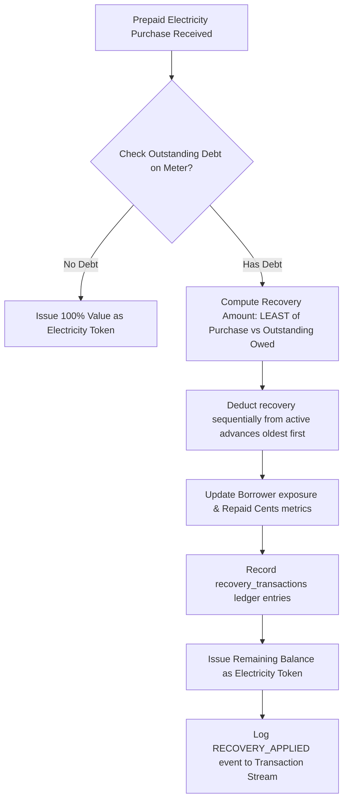

# ⚡ VoltAdvance

> **Utility Credit Infrastructure for Township Communities**
>
> VoltAdvance is a micro-credit platform built to solve the utility poverty gap. It bridges phone-based identities (WhatsApp conversational bot) with prepaid utility meters (recovery assets), enabling low-income households to access emergency electricity credits with automated transactional recovery.

---

## 📖 Table of Contents
1. [System Overview](#-system-overview)
2. [Architecture & Technology Stack](#-architecture--technology-stack)
3. [Database Schema & Transaction Ledger](#-database-schema--ledger)
4. [Risk & Fraud Evaluation Engine](#-risk--fraud-evaluation-engine)
5. [Automated Clearing & Settlement](#-automated-clearing--settlement)
6. [Operations Dashboard](#-operations-dashboard)
7. [GitHub Actions: Keep Supabase Awake](#-github-actions-keep-supabase-awake)
8. [Getting Started & Local Development](#-getting-started)

---

## ⚡ System Overview

VoltAdvance targets prepaid utility customers who experience sudden blackouts and lack immediate access to liquidity:
* **Conversational Interface**: Borrowers request emergency advances (`R50`, `R100`, `R200`, `R300`) directly via WhatsApp.
* **Asset-Backed Recovery**: When the borrower next purchases electricity through standard vending channels (e.g. digital wallets, bank integrations, or retail points), the platform automatically intercepts the payment, recovers the outstanding debt, and issues the remaining balance as electricity tokens.
* **Risk Shield**: A localized risk engine dynamically determines loan approvals and borrow limits based on real-time and historical consumer patterns.

---

## 🛠️ Architecture & Technology Stack

The platform is designed to run on a serverless, decoupled, and highly responsive architecture:

* **Frontend & Control Panel**: Built with **Next.js (App Router)** and styled using a custom **Vanilla CSS Design System** optimized for sub-millisecond rendering and full mobile responsiveness (fluid flex grids, overflow scroll boundaries).
* **Database & Logic Layer**: Backed by **Supabase (PostgreSQL)**. Core transaction ledger management and debt clearing are handled atomically inside PostgreSQL using PL/pgSQL database functions.
* **Conversational Bot Endpoint**: API routes handle incoming Webhook payloads (Twilio standard formatting) and manage session states (`AWAITING_METER_LINK`, `AWAITING_BUY_AMOUNT`, `AWAITING_ADVANCE_AMOUNT`, `IDLE`).
* **WhatsApp Simulator**: An in-dashboard iOS device emulator that simulates real-time conversational messaging and logs response parameters directly to verify bot routing and messaging patterns.

---

## 🗄️ Database Schema & Ledger

VoltAdvance enforces strict data integrity using transactional tables and indexes (defined in `supabase/schema.sql`):

### 1. `borrowers` (Identity Layer)
* Stores phone number identities, total repaid cents, active outstanding exposure, and dynamically computed trust scores.

### 2. `meters` (Asset Recovery Layer)
* Tracks physical prepaid meter numbers, provider names, active statuses (`ACTIVE`, `FLAGGED`, `SUSPENDED`), and total outstanding debt associated with the meter.

### 3. `meter_borrower_links` (Association Table)
* Many-to-many relationship mapping phone numbers to meters, enforcing a unique active link constraint to prevent fraud.

### 4. `advances` (Credit Instruments)
* Tracks loan ledger balances including principal cents, administrative fees (10%), outstanding balances, and active repayment statuses (`ACTIVE`, `PARTIALLY_REPAID`, `SETTLED`, `DEFAULTED`).

### 5. `recovery_transactions` & `meter_purchases`
* Auditable logs tracking exact payment collections and standard utility top-ups.

---

## 🛡️ Risk & Fraud Evaluation Engine

Located in `lib/risk-engine.ts`, the risk engine determines the credit limit for any linked user:

$$Score = Base (50) + MeterAge + PurchaseFreq + SpendFactor + RepaymentHistory - Penalties$$

### Parameters:
1. **Meter History (Max +20)**:
   - Evaluates the age of the prepaid meter installation.
   - Evaluates regular purchase activity frequency (e.g., standard recharges per month).
2. **Repayment Record (Max +25)**:
   - Computes loan success ratios: $Rate = \frac{Repaid}{Issued}$.
   - Awards a fast-payback speed bonus ($<7$ days gets $+5$ points).
3. **Risk Penalties (Reduces Score)**:
   - **Active Debt**: $-10$ points if there is an active outstanding advance.
   - **Multi-Phone Abuse**: $-15$ points if the meter is shared across $>3$ phone numbers.
   - **Fraud Pattern**: $-20$ points for suspicious load behaviors.

### Tiers & Limits:
* **Score $\ge$ 81 (Premium)**: Limit: `R300` ($30000$ cents)
* **Score 61 - 80 (Standard)**: Limit: `R100` ($10000$ cents)
* **Score 41 - 60 (Basic)**: Limit: `R20` ($2000$ cents)
* **Score $\le$ 40 (Declined)**: Limit: `R0` (Declined)

---

## 🔄 Automated Clearing & Settlement

Settlement of credit advances runs inside the transaction database via the `execute_purchase_clearing_v1` procedure.

### Step-by-Step Execution:


---

## 📊 Operations Dashboard

The operations workspace contains standard management layouts designed for mobile viewing:

* **Overview Panel**: Dynamic graphs showing daily Advance Volume vs Recovery trends, risk distribution tier counts, and current system-wide aggregates.
* **Advance Ledger**: Log of all credit transactions, allowing operators to filter active outstanding claims.
* **Meters & Borrowers Registries**: Full directories showing active linkages, outstanding balances, and real-time trust scores.
* **Recovery Engine**: Tracks collection success rates, average time-to-repayment, and recovery logs.
* **System Event Stream**: A real-time WebSocket/Polling stream logging core audit events (e.g., `ADVANCE_ISSUED`, `RECOVERY_APPLIED`).

---

## ⏰ Keep-Awake Infrastructure (Supabase Free Tier)

Because the application uses free-tier serverless PostgreSQL on Supabase, the database will pause after 7 days of inactivity. To prevent this, three alternative keep-awake options are provided:

### Option A: Supabase Native pg_cron (Recommended)
You can run a scheduled cron job directly inside your PostgreSQL database. This is serverless, 100% free, and requires no external runners.
1. Open your Supabase Dashboard and go to the **SQL Editor**.
2. Run the commands in [keep-awake-cron.sql](file:///home/zolile/Documents/voltadvance/supabase/keep-awake-cron.sql) to enable `pg_cron` and schedule a heartbeat query every 3 days.

### Option B: Vercel Cron (Serverless API Ping)
If the Next.js app is hosted on Vercel:
- The `/api/cron/keep-alive` endpoint executes a lightweight query.
- The cron schedule in `vercel.json` calls this endpoint every 3 days.
- Secure the route by setting a `CRON_SECRET` environment variable in Vercel.

### Option C: Local or VPS Script (cron/systemd)
Run a script locally or on a server to ping either Supabase or the Next.js API route:
1. Navigate to the project root and run:
   ```bash
   node scripts/keep-awake.mjs
   ```
2. Schedule this script in your server's `crontab` to run every 3 days:
   ```text
   0 9 *\/3 * * /usr/bin/node /path/to/voltadvance/scripts/keep-awake.mjs >> /path/to/voltadvance/keep-awake.log 2>&1
   ```

---

## 🚀 Getting Started

### Prerequisites
* **Node.js**: Version 18 or higher.
* **Supabase Account**: An active Postgres DB instance.

### Installation
1. Clone the repository and navigate to the project directory:
   ```bash
   cd voltadvance
   npm install
   ```

2. Set up environment variables inside `.env.local` in the project root:
   ```env
   # Supabase Configuration
   NEXT_PUBLIC_SUPABASE_URL=https://your-project-id.supabase.co
   NEXT_PUBLIC_SUPABASE_ANON_KEY=eyJhbGciOiJIUzI1NiIsInR...
   SUPABASE_SERVICE_ROLE_KEY=eyJhbGciOiJIUzI1NiIsInR...
   ```

3. Run the database setup. Execute the contents of `supabase/schema.sql` inside your Supabase project's SQL Editor to initialize tables, indexes, and the PL/pgSQL transaction clearance script.

4. Start the local Next.js development server:
   ```bash
   npm run dev
   ```

5. Open your browser and navigate to `http://localhost:3000` to access the Landing Page or `http://localhost:3000/dashboard` to access the Operations Workspace.

---

## 📄 License
Project source is confidential and proprietary. Designed and maintained for utility financial infrastructure operations.
